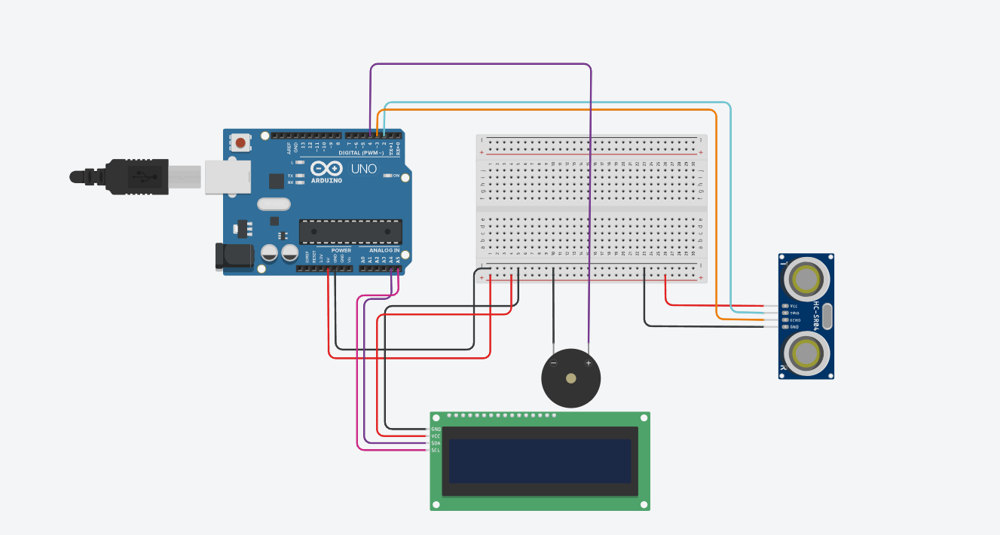
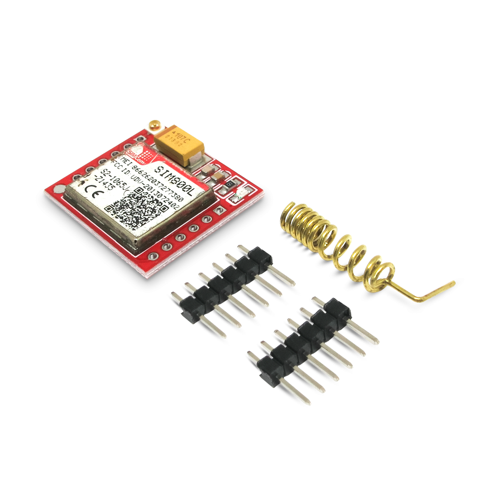

# 💧 GS - Bueiro Inteligente com Alerta via SMS

## 🚀 Descrição do Projeto

Este projeto tem como objetivo prevenir entupimentos e alagamentos urbanos através de um **bueiro inteligente**, capaz de **monitorar o nível de resíduos** com um sensor ultrassônico. Quando o limite de resíduos é atingido, um **alerta via SMS** é enviado ao responsável pela manutenção, utilizando o **módulo GSM SIM800L**.

## 🧠 Funcionamento

- O **sensor ultrassônico HC-SR04** mede a distância entre o topo do bueiro e o nível de resíduos.
- Quando essa distância for **menor ou igual a 10 cm**, significa que o bueiro está cheio.
- O sistema então emite um alerta:
  - **Protótipo**: buzzer sonoro e mensagem no display LCD.
  - **Aplicação real**: envio de SMS informando a necessidade de esvaziamento.

---

## 🔧 Componentes Utilizados

### 🎛️ Protótipo (Simulador)

- 1x Arduino Uno  
- 1x Sensor Ultrassônico HC-SR04  
- 1x Display LCD 16x2 com módulo I2C  
- 1x Buzzer Piezoelétrico  
- 1x Protoboard  
- Cabos jumpers (macho-macho e macho-fêmea)

### 📡 Para Envio de SMS (SIM800L)

- 1x Módulo GSM GPRS SIM800L  
- 1x Fonte de alimentação externa (4.0V a 4.2V – **essencial**)  
- Capacitores de desacoplamento (1000µF — opcional)  
- Regulador ou divisor de tensão para comunicação RX/TX (SIM800L opera em 3.3V)

---

## 🔌 Esquemático de Conexões

### 📐 Protótipo no Simulador

| Componente       | Pino Arduino | Descrição                  |
|------------------|--------------|----------------------------|
| HC-SR04 - Trig   | D9           | Disparo do ultrassônico    |
| HC-SR04 - Echo   | D10          | Recepção do sinal          |
| HC-SR04 - VCC    | 5V           | Alimentação                |
| HC-SR04 - GND    | GND          | Terra                      |
| Buzzer           | D8           | Alerta sonoro              |
| LCD - SDA        | A4           | Comunicação I2C            |
| LCD - SCL        | A5           | Comunicação I2C            |
| LCD - VCC / GND  | 5V / GND     | Alimentação                |

### 📶 Módulo GSM SIM800L

| SIM800L         | Conexão            | Observações                                              |
|------------------|--------------------|----------------------------------------------------------|
| VCC              | Fonte externa (4V) | ⚠️ Nunca ligar direto no 5V do Arduino                  |
| GND              | GND                | Terra comum                                              |
| TX               | D7 (RX Arduino)    | Comunicação serial                                       |
| RX               | D6 (TX Arduino)    | ⚠️ Usar divisor de tensão (SIM800L usa 3.3V nos sinais) |

> ⚠️ **Importante:** O SIM800L exige fonte de 4.0V–4.2V com corrente mínima de **2A**.

---

## 📨 Lógica de Envio de SMS

Quando o lixo ultrapassa o limite (≤ 10 cm), o Arduino envia comandos AT ao SIM800L, que transmite o seguinte SMS:

> **📲 “Atenção! O bueiro localizado em [local] está cheio. Favor realizar a manutenção.”**

---
 ## 🧪 **Como Simular o Projeto no Tinkercad**  
Você pode testar o funcionamento básico do projeto (sem o módulo GSM) diretamente no simulador online Tinkercad.  

🔗 Acesse o projeto no Tinkercad pelo link:  

👉 [Simular no Tinkercad - Bueiro Inteligente](https://www.tinkercad.com/things/gH5OR1aNBKg-bueiro-inteligente?sharecode=_kgdMWjJRYhMHPt-zChGMjxzrbSMveiN8-94f1-tAgg)  

 No simulador, você verá o funcionamento do sensor ultrassônico, display LCD e alerta sonoro via buzzer.  

### 🚀 **Passos para simular:**  
1. Acesse o link acima.  
2. Clique em **“Tinker este projeto”** (ou **"Tinker this"**) para abrir no modo de edição.  
3. Clique em **“Iniciar Simulação”** no canto superior direito.  
4. Observe o funcionamento:  
   - O display LCD mostrará o status.  
   - O buzzer soará quando o nível de lixo estiver acima do limite.  
5. Você pode interagir ajustando a distância no sensor ultrassônico para simular diferentes níveis de lixo no bueiro.  

> ⚠️ O envio de SMS não é suportado no simulador. Essa funcionalidade ocorre apenas no hardware real.

## 📷 Imagens do Projeto

### ✅ Protótipo no Simulador  

### ✅ Módulo GSM SIM800L  

